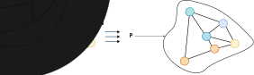
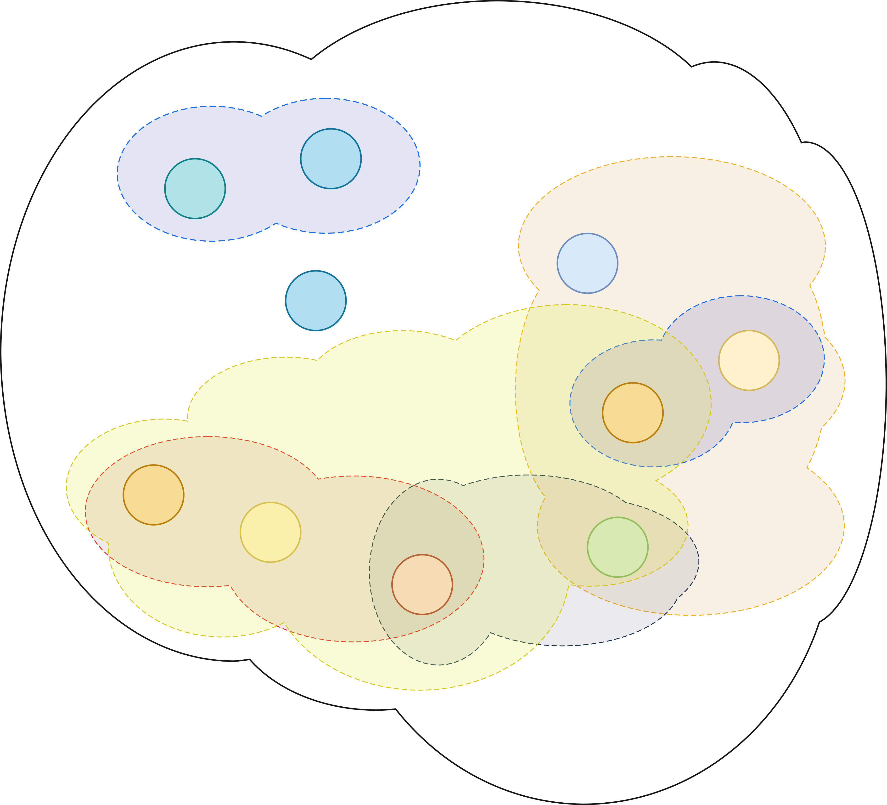
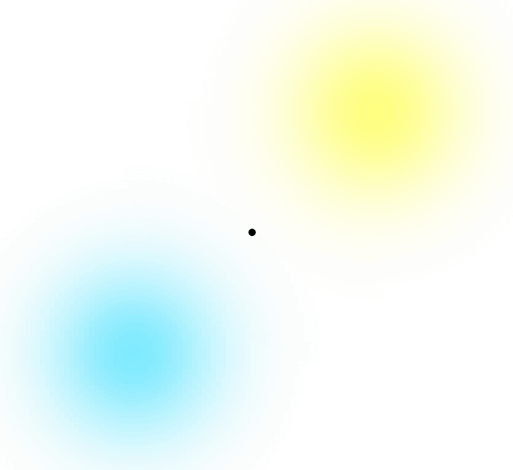

+++

title = "SIESTA 2025 - Student Talk"
description = "Angela Cortecchia - SIESTA 2025 - Student Talk"
outputs = ["Reveal"]

+++

# Towards Collective Operating Systems through Aggregate Computing
#### Student Talk @ SIESTA 2025

[Angela Cortecchia](mailto:angela.cortecchia@unibo.it) - PhD Student @ University of Bologna

--- 





# Potential Application

In smart cities applications, e.g. _crowd management_ and _surveillance_, 
many **heterogeneous sensors** and **devices** can be employed to:
- *Detect* crowd;
- *Steer* the crowd *to prevent* hazardous situation;
- Potentially, let law enforcement *intervene*.



--- 




# Challenges

Common approaches usually consist of _programming each single device_.

**Non-scalable** when thousands of different devices are involved.

- *Different* way to implement *programs on different devices*;
- Some devices do *not support all functionalities*;
- *Time expensive* to program each single device;
- Devices have a *limited vision of the system*;
- *Non-friendly programming* for the developer.

<!-- - Not all devices support the same functionalities; -->


---





# What do we need?

{}

{}

### Crowd Management scenario

<ul>
    <li class="fragment" data-fragment-index=0>Drones and sensors <em>observe and send data</em> to the system;</li>
    <li class="fragment" data-fragment-index=1>Crowd <em>steering based on data</em> evaluation;</li>
    <li class="fragment" data-fragment-index=2><em>Coordination</em> between devices;</li>
    <li class="fragment" data-fragment-index=3>Law enforcement <em>intervention</em>;</li>
</ul>
{}

{}
### Effective technologies

<ul>
    <li class="fragment" data-fragment-index=0><em>Distributed</em> sensors and actuators able to <em>execute multiple programs</em>;</li>
    <li class="fragment" data-fragment-index=1>Communication between <em>different processes</em>;</li>
    <li class="fragment" data-fragment-index=2><em>Intra-process</em> communication;</li>
    <li class="fragment" data-fragment-index=3>Third-party entities able to <em>interrupt, pause, or add processes at runtime</em>.</li>
    <!-- <li>Interoperability between different devices.</li> -->
</ul>

{}

{}



--- 





# Meet Aggregate Computing

A programming paradigm to **define the behavior of a collective of heterogeneous devices**.

Every device runs the same program and *adapts to dynamic changes in the environment*.

### Current limitations:

- Aggregate systems **run just one program**;
- *Can not* be modified, added, or interrupted *at runtime without affecting other devices*.



---





# Idea: *Collective* Operating Systems

{}



Aim to *parallel the main functionalities of modern OSs*,
from a **collective** point of view:

<!-- Closing the gap of the current technologies: -->

- Runtime program injection;
- Users and permissions;
- Signal and interrupts;
- Multiple processes able to communicate;
- Distributed sensors and actuators;
- Intra-process communication.



{}

{}

{}



--- 





# What I've done so far

<!-- sviluppo di Collektive, integrazione con Alchemist, primi test con android -->
<!-- ricerca: algoritmo di morfogenesi per la gestione delle risorse distribuite -->

{}

{}

Development of **Collektive**: a framework for Aggregate Computing in _Kotlin Multiplatform_;

Integration of the tool with the Alchemist Simulator;

{}

{}

Implementation of a morphogenesis algorithm with _Collektive_, for the management of distributed resources;

First testings on Android and iOS devices;

{}
{}


---




# What's next?

{}

{}

**Short term**:
 - Implementation of self-stabilizing Gossip and Gradient algorithms, reducing communication overhead while preserving accuracy.
 - Extension of the Collective OS model with *users, permissions, signals, and inter-process communication*.
 - Validation on reference scenarios: crowd management, autonomous navigation, smart cities.

{}

{}

**Long term vision**:
 - Development of a full prototype of a **Collective Operating System**, open-source and deployable on heterogeneous devices.
 - Towards resilient, adaptive collective systems with tangible impact on safety, sustainability, and coordination at scale.

<!-- working on a gossip and gradient algorithm that will reduce the communication -->
<!-- test of the architecture on real systems eg. notte dei ricercatori -->

{}
{}

## Also, **suggestions**?



<!-- 
What excites you in your field
Your current research focus
What you’ve done so far
But — most importantly — what you plan to do next! 
-->
